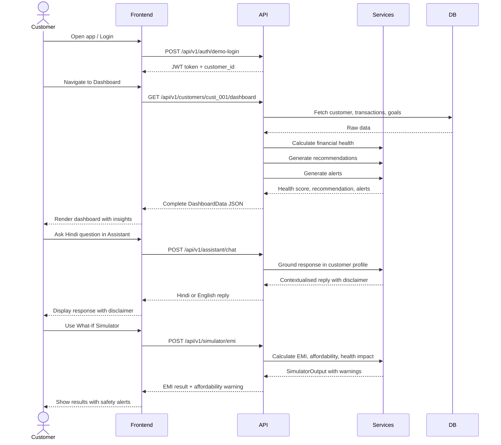
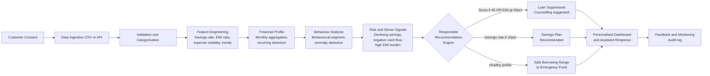
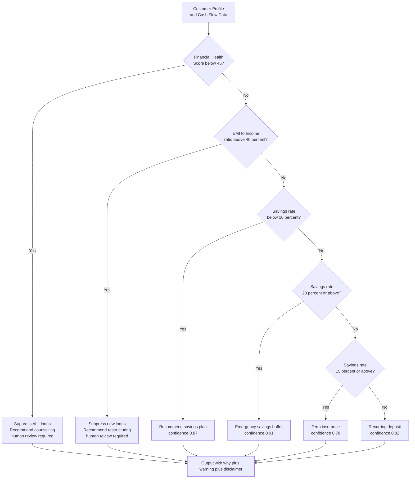
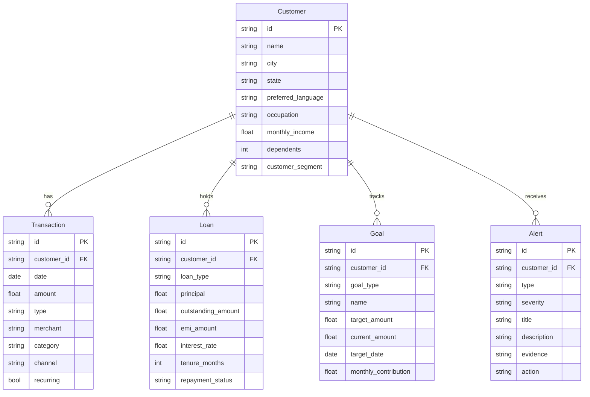
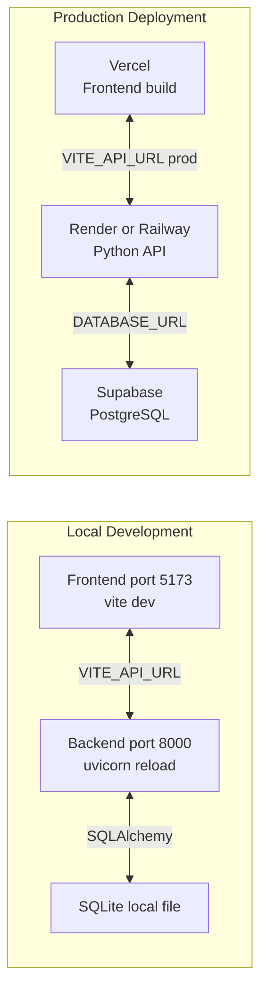

# Saarthi Finance — System Architecture

> **Banking that understands your next step.**
> An explainable financial guidance and responsible lending-assistance platform for Bharat.

---

## Overview

Saarthi Finance is a layered, event-driven platform that converts raw synthetic financial behaviour into explainable, actionable guidance. The architecture separates concerns clearly: data ingestion, feature engineering, intelligence (rules + optional ML), API service, and presentation.

The platform **never** makes automatic credit decisions. Every output carries:
- Input factors used
- Decision logic applied
- Confidence level
- Human-review flag when needed

---

## High-Level Architecture Diagram

```mermaid
graph TB
    subgraph Customer["Customer — Bharat"]
        C1[Mobile Browser / App]
    end

    subgraph Frontend["Frontend — React + Vite + TypeScript"]
        F1[Login Page]
        F2[Dashboard]
        F3[Spending Analysis]
        F4[Responsible Borrowing]
        F5[Goal Planning]
        F6[What-If Simulator]
        F7[AI Assistant]
        F8[Alerts Screen]
        F9[API Client Layer with Mock Fallback]
    end

    subgraph Backend["Backend — FastAPI + Python 3.11"]
        B1[Auth Router]
        B2[Customer Router]
        B3[Dashboard Router]
        B4[Transactions Router]
        B5[Spending Router]
        B6[Recommendations Router]
        B7[Alerts Router]
        B8[Goals Router]
        B9[Simulator Router]
        B10[Assistant Router]
        B11[Ingest Router]
    end

    subgraph Services["Service Layer"]
        S1[Financial Health Calculator]
        S2[Recommendation Engine]
        S3[Alert Generation Service]
        S4[Spending Analyser]
        S5[Simulator Engine]
        S6[AI Assistant Service]
        S7[Data Ingest and Categorisation]
    end

    subgraph Database["Database — SQLite / Supabase PostgreSQL"]
        D1[(Customers)]
        D2[(Transactions)]
        D3[(Loans)]
        D4[(Goals)]
        D5[(Alerts)]
    end

    subgraph DataLayer["Data and ML Layer — Python + pandas"]
        ML1[Synthetic Data Generator]
        ML2[Transaction Categoriser]
        ML3[Feature Engineering]
        ML4[Financial Health Scoring]
        ML5[Behavioural Segmentation]
        ML6[Anomaly Detection]
        ML7[Stress Signal Detector]
        ML8[Responsible Recommendation Engine]
        ML9[JSON Fixture Exporter]
    end

    subgraph ExternalOptional["External — Optional"]
        E1[OpenAI-Compatible LLM API]
        E2[Supabase Auth]
    end

    C1 --> F1
    F1 --> F2
    F2 --> F3
    F2 --> F4
    F2 --> F5
    F2 --> F6
    F2 --> F7
    F2 --> F8
    F9 -.->|HTTP + CORS| B1
    F9 -.->|HTTP + CORS| B3
    F9 -.->|HTTP + CORS| B6
    F9 -.->|HTTP + CORS| B7
    F9 -.->|HTTP + CORS| B9
    F9 -.->|HTTP + CORS| B10
    F9 -->|Mock fallback if offline| F2

    B1 --> S1
    B3 --> S1
    B3 --> S2
    B3 --> S3
    B3 --> S4
    B6 --> S2
    B7 --> S3
    B9 --> S5
    B10 --> S6
    B11 --> S7

    S1 --> D1
    S1 --> D2
    S2 --> D1
    S3 --> D5
    S4 --> D2
    S7 --> D2

    ML1 --> D1
    ML1 --> D2
    ML3 --> ML4
    ML4 --> ML7
    ML7 --> ML8
    ML8 --> ML9
    ML9 -->|JSON fixtures| B11

    S6 -.->|Optional| E1
    B1 -.->|Optional| E2
```

---

## Data Flow Sequence

---

## Intelligence Engine Flow

---

## Responsible Recommendation Engine

---

## Component Reference

### Frontend — `apps/web`

| Component | Technology | Notes |
|---|---|---|
| Framework | React 18 + TypeScript | Strict mode |
| Build tool | Vite | Fast HMR, ESM output |
| Styling | Tailwind CSS | CSS variables for theme |
| Charts | Recharts | Donut, bar, area charts |
| Routing | React Router v6 | SPA with protected routes |
| State | Context API | AuthContext for session |
| API client | `lib/api.ts` | Real API + mock fallback |
| Mock data | `data/mockData.ts` | Ananya Verma persona |

**Pages:** LoginPage, DashboardPage, SpendingPage, BorrowingPage, GoalsPage, SimulatorPage, AssistantPage, AlertsPage

### Backend — `apps/api`

| Component | Technology | Notes |
|---|---|---|
| Framework | FastAPI 0.110+ | Auto OpenAPI docs at /docs |
| Validation | Pydantic v2 | Request/response schemas |
| ORM | SQLModel | SQLite / PostgreSQL compatible |
| Database | SQLite dev, Supabase prod | Auto-seeded on startup |
| Auth | Mock JWT | Supabase-compatible design |
| CORS | FastAPI middleware | localhost + 127.0.0.1 any port |
| Logging | Python stdlib | Structured with level config |
| Seed | `app/seed.py` | Auto-runs on startup |

### Data and ML — `ml/src`

| Module | Purpose |
|---|---|
| `generate_data.py` | Creates 10 customer synthetic datasets |
| `preprocess.py` | Schema validation, categorisation, deduplication |
| `features.py` | 11 engineered features per customer |
| `health_score.py` | Weighted, explainable 0–100 scoring |
| `segmentation.py` | Rule-based behavioural segments |
| `anomaly.py` | IQR + rolling median anomaly detection |
| `stress.py` | Multi-signal financial stress classifier |
| `recommendations.py` | Responsible product recommendation engine |
| `personas.py` | Named demo personas (Ananya, Ramesh, Meena, Arjun) |
| `export_fixtures.py` | Exports JSON for backend consumption |

---

## Financial Health Score Components

| Component | Weight | Scoring Logic |
|---|---|---|
| Income Stability | 18% | stable=85, variable=55, declining=30 adjusted by variance |
| Savings Rate | 18% | 30%+ gives 95; 20%+ gives 75; 10%+ gives 50; below 5% gives 20 |
| Expense Management | 15% | Expense/income: below 40% gives 90; above 80% gives below 20 |
| Debt Burden | 18% | EMI/income: below 10% gives 95; below 30% gives 75; above 50% gives below 20 |
| Repayment Behaviour | 15% | 0 missed gives 95; below 5% miss rate gives 80; above 20% gives below 25 |
| Liquidity | 16% | Emergency fund months: 6+ gives 95; 3+ gives 75; below 0.5 gives 15 |

---

## Database Entity Relationship

---

## Deployment Architecture

---

## Environment Variables

| Variable | Used By | Description |
|---|---|---|
| `VITE_API_URL` | Frontend | Backend base URL |
| `VITE_USE_MOCK` | Frontend | Force mock data when set to true |
| `DATABASE_URL` | Backend | PostgreSQL connection string |
| `BACKEND_URL` | Backend | Self-reference for links |
| `LLM_API_KEY` | Backend | OpenAI-compatible key, optional |
| `JWT_SECRET` | Backend | JWT signing secret |
| `LOG_LEVEL` | Backend | Logging verbosity |

---

## Frontend-to-Backend Integration Points

| Frontend function | Backend route | Fallback behaviour |
|---|---|---|
| `getDashboard(id)` | `GET /api/v1/customers/{id}/dashboard` | Returns MOCK_DASHBOARD |
| `demoLogin(phone)` | `POST /api/v1/auth/demo-login` | Returns mock token |
| `getAlerts(id)` | `GET /api/v1/customers/{id}/alerts` | Returns mock alerts |
| `getGoals(id)` | `GET /api/v1/customers/{id}/goals` | Returns mock goals |
| `calculateEmi(input)` | `POST /api/v1/simulator/emi` | Uses local JS formula |
| `sendMessage(req)` | `POST /api/v1/assistant/chat` | Uses template replies |

---

*Architecture version 1.0 — Saarthi Finance Hackathon Build — Laptop 4*
